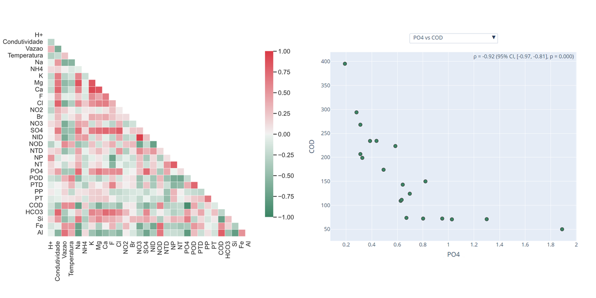

# Geohmount
 Analysis of air masses distribution and exploratory correlation of chemical variables in aquatic environments of Serra dos Órgãos, Rio de Janeiro. The analyzes were conducted in three locations of PARNASO (Serra dos Órgãos Park): Pedra do Sino, Bonfim and Soberbo.

 ## Air masses
 By investigating the polar charts of the aforementioned locations, it was possible to correlate the distribution patterns with geographic and chemical informations about the local precipitation, based on the relationship between aerosols - which are carried by air masses over long distances - and rain composition, also called wet deposition:

- The Atlantic Ocean, Guanabara Bay and the Metropolitan Region of Rio de Janeiro (RMRJ) are the main compositional contributors to the atmospheric input in PARNASO, as shown by the south, south-east and south-west quadrants.

- In Soberbo, PARNASO's oceanic slope, inorganic nitrogen (NH4+ and NO3-) is dominant, which corroborates this hypothesis because Guanabara Bay is a known source of NH3 and RMRJ of nitrogen oxides (NOx), which are converted to NO3- in aqueous media.

- On the other hand, a more continental contribution was observed in Pedra do Sino and Bonfim, which is marked as PARNASO's continental slope. Even so, there is a non-negligible contribution of RMRJ from SW which shouldn't be disconsidered.

 
 
It can be observed that higher wind speeds are registered in Pedra do Sino. This is caused by its high altitude, which increases the pressure gradient between cold and warm air, thus resulting in stronger winds.  

Another information that can be extracted from the plots colored by precipitation is that Pedra do Sino and Soberbo are associated with more extreme rain events, reinforcing the influence of more humid, oceanic air masses that precipitates orographically.
  
 

## Correlation analysis

Correlation analyses can be imployed to explore relations between numerical variables (linear, exponential, etc.) for different applications. 

In this project, a correlation analysis of chemical variables in the aforementioned locations is presented in a table, a heatmap and a interactive scatterplot, allowing screening and more detailed investigation of the variables relationships. The interactivity of [Plotly](https://plotly.com/) charts were used to allow the selection of X and Y data and automatic update of Spearman's correlation metrics.

## About
These analyses composed my first applied project built with Python, as part of one of my undergraduate researches in the Geochemistry field.